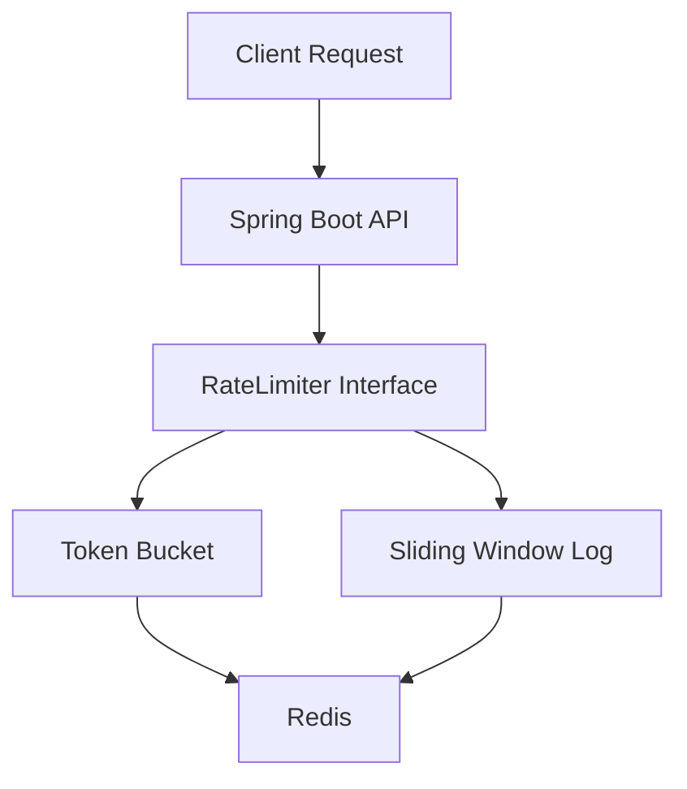
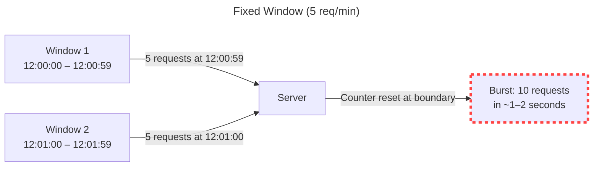
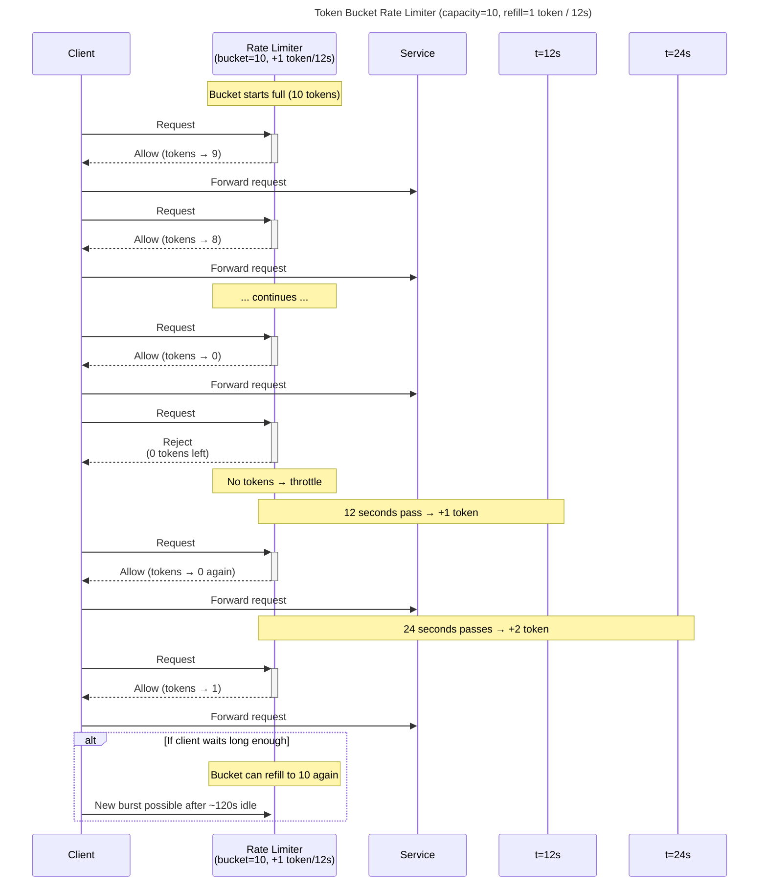

# Distributed Rate Limiter

<p align="left">
  
  
  
  
  
</p>


## Overview
This project is a high performance, distributed rate limiter library created to prevent API abuse and cascading failures. It showcases multiple strategies to tackle request handling for different level for businesses. It highlights pros and cons of each strategy and find one based on your specific memory requirements and precision priority.

## Architecture


## Algorithms Implemented
- Fixed Window
- Token Bucket
- Sliding Window Log

### In-Memory Fixed Window
Simplest way to handle rate limiting, it utilizes fixed windows to track user requests and resets them at the next window. 

The primary trade-off being a boundary burst. For example, a user can double their limit by sending 5 requests (limit) at 12:00:59 and another 5 requests at 12:01:00 leading to 10 requests in 2 seconds.



### Token Bucket
This strategy addresses the burst requests issue that fixed window was facing. Rather than resetting, it adds new tokens using a refill timer. It tracks the elapsed time between the last time user made a request and the current time and refills the tokens accordingly. 



### Sliding Window Log
Sliding window is quite similar to token bucket, the only difference is the fact that sliding window is very strict about allowing requests and maintaining the fact that only the required amount of requests are allowed. 

It won't allow any new requests until the requests in the window is smaller than the limit, unlike token bucket which allows request after the refill timer passes.

## Redis Implementation
Since rate limiting happens on every single request, it must be extremely fast to prevent latency. Redis stores data in RAM, offering microsecond latency. 

Redis also acts as the shared state for all spring boot nodes. Otherwise Node A can allow 5 requests and Node B allow 5 requests bypassing the limit. 

1. The token bucket implementation utilizes redis hash to store just two values, timestamp when last refilled and the current tokens. This keeps the memory constant regardless of how many requests a user makes.


2. The sliding window uses a ZSET (sorted set) where each request is scored by it's timestamp. This allows for high-precision limiting by using ZREMRANGEBYSCORE to slide the window and remove expired entries.


## Concurrency Handling
To ensure thread safety and accuracy in a distributed environment, this project utilizes Redis Lua scripting. This prevents race conditions and preventing going over the limit. 

Consolidating multiple operations like ZADD, ZREMRANGEBYSCORE, ZCARD in the same script minimizes network overhead and latency.

## Testing
Concrete tests are required to make sure the rate limiter is working as intended. This project utilizes multiple tests to verify the integrity of the algorithms at work.

If you're interested in running these tests yourself, you can run the following command in the repository.

```bash
./mvnw test
```

#### Integrated testing with testcontainers
This test uses Testcontainers to spin up a localized Redis instance during the build phase. This ensures that the lua scripts and redis interactions are tested against a real server rather than mock.

```java
@Container
static GenericContainer<?> redis = new GenericContainer<>(DockerImageName.parse("redis:7.0-alpine"))
        .withExposedPorts(6379);

@Test
void shouldAllowInitialRequestsAndBlockFollowing() {
    String userId = "user1";

    // rate limit
    for (int i = 0; i < 5; i++) {
        assertTrue(limiter.isAllowed(userId), "Request" + (i + 1) + "should be allowed");
    }

    assertFalse(limiter.isAllowed(userId), "6th request should be blocked");
}
```

#### Stress test
This is another similar test, though this uses a threadpool to simulate 1000 simultaneous requests on 100 threads to properly ensure "Check-and-set" atomicity.

```java
@Test
void shouldNotExceedCapacityUnderConcurrency() throws InterruptedException {
    int threads = 100;  
    int requests = 1000;

    ExecutorService executor = Executors.newFixedThreadPool(threads);
    AtomicInteger allowed = new AtomicInteger();

    for (int i = 0; i < requests; i++) {
        executor.submit(() -> {
            if (limiter.isAllowed("user1")) {
                allowed.incrementAndGet();
            }
        });
    }

    executor.shutdown();
    executor.awaitTermination(5, TimeUnit.SECONDS);
    assertTrue(allowed.get() <= 5);
}
```

### Contact
Mayank Joshi - @dirtyyuka - mayankjoshi455@gmail.com
<br>
Project link: https://github.com/dirtyyuka/distributed-rate-limiter


